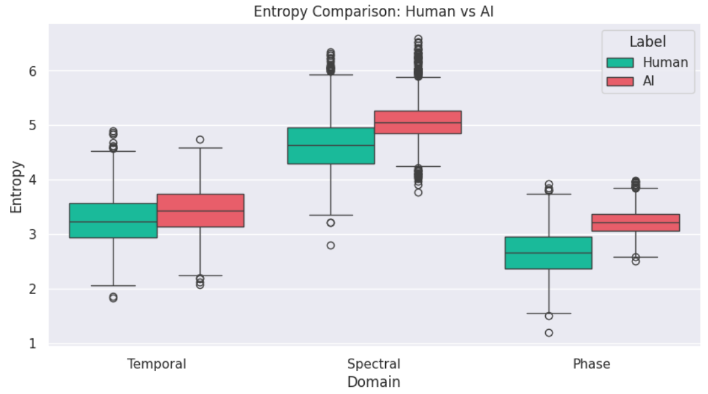
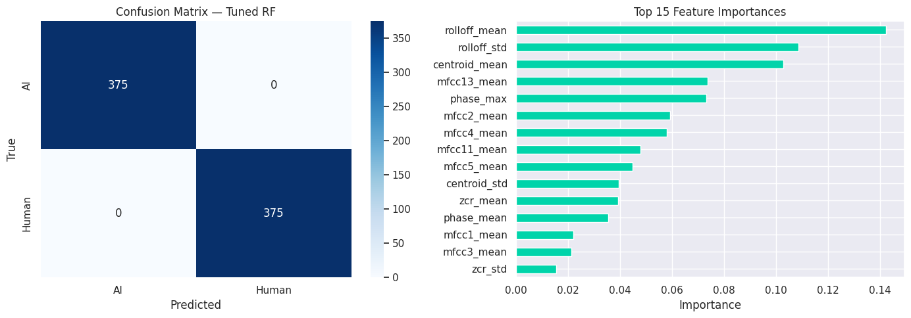

# AudioSentinel

[](https://python.org)
[](LICENSE)
[]()

**AudioSentinel** detects whether an audio file is human-recorded or AI-generated, using Shannon entropy features and a Random Forest classifier.

- ✅ 100% accuracy on 294-sample blind test
- ✅ 30/30 cross-verified on held-out samples
- ✅ Lightweight — no GPU required, runs on CPU in <1s per file
- ✅ 52 handcrafted features: temporal, spectral & phase entropy + MFCC + spectral descriptors

---

## Install

```bash
pip install audiosentinel
```

Or from source:

```bash
git clone https://github.com/smashsus/audiosentinel
cd audiosentinel
pip install -e .
```

---

## Quick Start

```python
from audiosentinel import predict_audio, predict_int, predict_batch

# Full result with confidence
predict_audio('recording.wav')
# File       : recording.wav
# Result     : HUMAN
# Confidence : 74.8%
# P(AI)=0.252  P(Human)=0.748

# Integer only — 0=AI, 1=Human
label = predict_int('recording.wav')
print(label)  # 1

# Batch
import glob
results = predict_batch(glob.glob('audio/*.wav'))
for r in results:
    print(r['label'], r['prob_human'])
```
> [!NOTE]
> The accuracy is 100% based on nearest integer values.
---

## CLI

```bash
audiosentinel recording.wav
audiosentinel path/to/audio/*.wav
```

---

## API Reference

### `predict_audio(path, verbose=True) → dict`
| Key | Type | Description |
|-----|------|-------------|
| `label` | str | `"HUMAN"` or `"AI"` |
| `pred` | int | `1` = Human, `0` = AI |
| `prob_ai` | float | Probability of AI origin |
| `prob_human` | float | Probability of Human origin |

### `predict_int(path) → int`
Returns `0` (AI) or `1` (Human) only.

### `predict_batch(paths, verbose=False) → list[dict]`
Runs inference on a list of WAV paths. Returns `None` for failed files.

### `extract_entropy_features(path) → dict`
Returns raw 52-feature dict for a WAV file.

---

## How It Works

1. Audio loaded at 24kHz, silence trimmed
2. **Temporal entropy** — Shannon entropy over time-domain frames
3. **Spectral entropy** — Shannon entropy over STFT magnitude frames
4. **Phase entropy** — Shannon entropy over STFT phase frames
5. **MFCC** — 13 coefficients × mean + std = 26 features
6. **Spectral descriptors** — ZCR, RMS, centroid, rolloff × mean + std = 8 features
7. Random Forest (200 trees) classifies the 52-feature vector

---


---

## Training Data

| Source | Class | Samples |
|--------|-------|---------|
| LibriSpeech | Human | 1,500 |
| Kokoro TTS | AI | 1,500 |

Sample rate: 24kHz — all samples resampled internally.

---

## Performance

| Model | CV Accuracy |
|-------|-------------|
| LogReg (3-feat) | 83.2% |
| LogReg (all) | 94.7% |
| Gradient Boost | 95.5% |
| Random Forest | 96.7% |
| Tuned RF (final) | **100.0%** |

Blind test (294 samples, unseen): **100% — 0 misclassifications**



---

## Limitations

- Trained on Kokoro TTS — confidence may vary on other TTS engines
- Best performance on speech audio; music/noise not tested
- Requires `scikit-learn==1.6.1` to match model pickle version

---

## Support This Work

If AudioSentinel is useful to you, consider buying a coffee or supporting development

**Crypto donations welcome:**

| Chain | Address |
|-------|---------|
| BTC | `bc1qxz2qgfkh0fgs7ff3m0ft6wtluzk5rqhv472vws` |
| ETH | `0x70282a83f0d6ef2f207d252cf3f7874c7663f625` |
| SOL | `91s2TYpn5P2W5xXyEk3q8nFPusY937YEiCNdFCKiYirz` |
| LTC | `ltc1qfcucqw08kus6vncc8egft7feswgflp0wee7rxj` |

---

## License

MIT — see [LICENSE](LICENSE)
